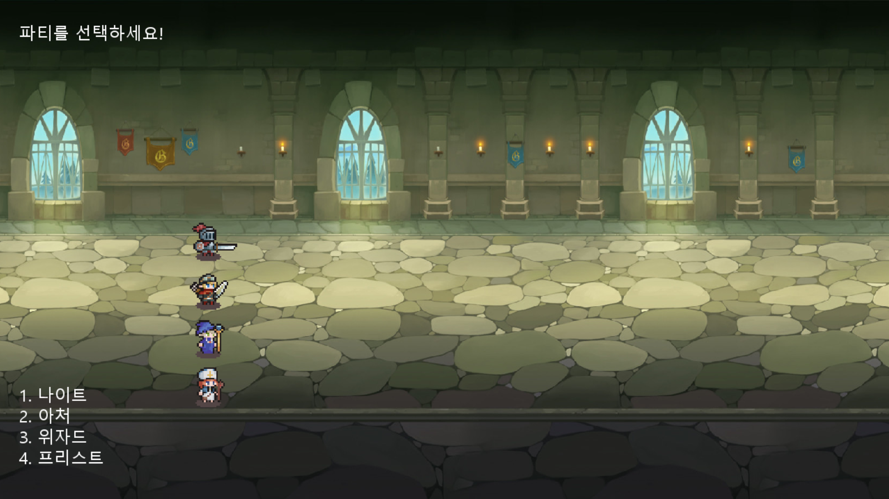
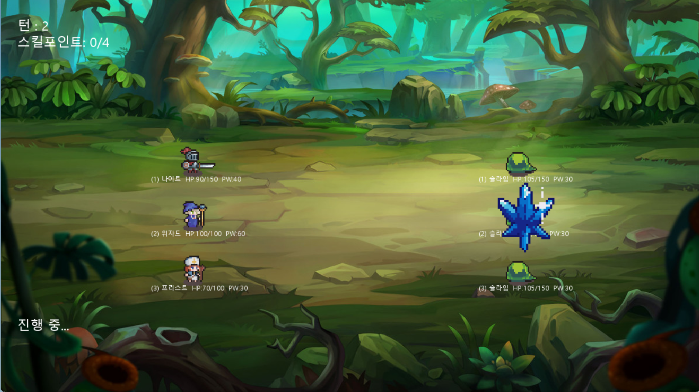
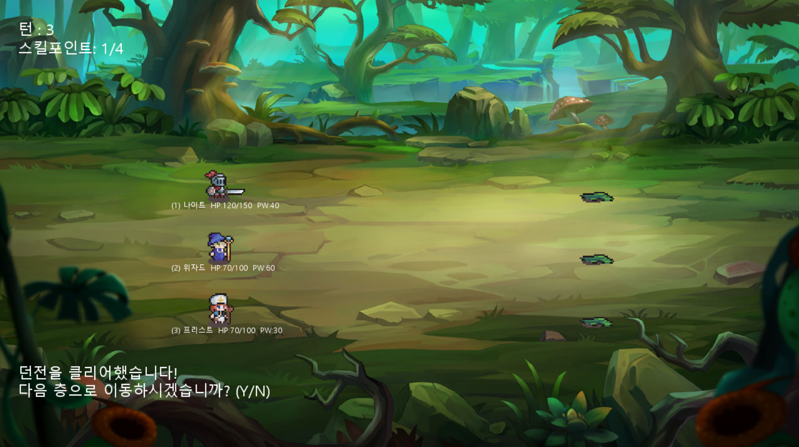
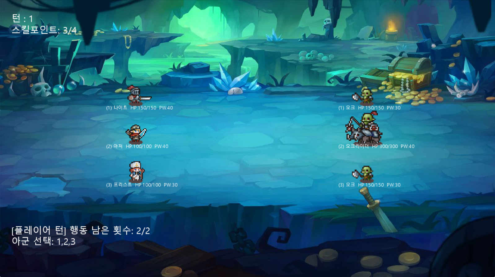

# 🎮 Turn-Based RPG (Pygame Project)
간단한 2D 턴제 RPG 게임입니다.  
플레이어는 4개의 캐릭터 중 3명을 선택하여 던전을 돌파하며,  
각 층마다 적을 처치하고 다음 스테이지로 이동하게 됩니다.

---
## 🚀 실행 방법

### 1. 필요한 라이브러리 설치
- pygame
```bash
pip install pygame
```

### 2. main.py 실행

---

## 📌 주요 기능

### ✔ 파티 선택 시스템
- 4개 클래스를 제공: **나이트, 아처, 프리스트, 위자드**
- 처음 시작 시 4명 중 3명을 선택하여 파티 구성
- 각 캐릭터는 고유한 스킬과 기본 공격을 가짐

---

### ✔ 턴제 전투 시스템
- 플레이어 턴 → 적 턴 순서로 진행
- 플레이어는 매 턴 **2번의 행동** 가능
- 아군/적 모두 각자 애니메이션 큐를 이용한 자연스러운 전투 연출

---

### ✔ 애니메이션 시스템 (Animation Queue)
모든 캐릭터는 **Animation Queue** 기반으로 동작함:
- 이동 → 공격 → 복귀 순서가 자연스럽게 이어짐  
- `hit_events` 를 통해 **프레임 기반 타격 타이밍** 구현  
- 정밀한 전투 연출 가능

**SpriteAnimator** 클래스는 스프라이트 시트를 읽어  
프레임 단위로 나누고 애니메이션을 재생합니다.

---

### ✔ 이펙트(Effect) 시스템
- 스킬/힐 등은 `EffectManager`가 통합 관리
- StaticEffect는 지정한 위치에서 주어진 duration 동안 재생
- 프레임 기반 update/draw 방식

---

### ✔ 스테이지(층) 기반 진행
- 한 층을 클리어하면 다음 층으로 이동할지 선택 가능
- 마지막 층 클리어 시 게임 종료 / 다시 시작 선택 가능

---

## 🎯 캐릭터 소개

### 🛡 나이트(Knight)
- 기본 공격: 단일 적 공격
- 스킬: 도발(Taunt) — 일정 턴 동안 자신에게 공격 유도
- 도발 종료 시 최대 체력 감소

### 🏹 아처(Archer)
- 기본 공격: 2명 동시 타격
- 스킬: 다발 사격 — 여러 프레임에 걸쳐 적을 난사

### ✝ 프리스트(Priest)
- 기본 공격: 단일 공격 + 작은 이펙트
- 스킬: 회복(Heal) — 아군을 치료 + 힐 이펙트

### ❄ 위자드(Wizard)
- 기본 공격: 단일 근거리 공격
- 스킬: 광역 공격(Blizzard) — 전체 적에게 피해  
  → 스택 기반으로 강화되는 얼음 공격

---

## 🔥 전투 시스템 상세

### ● 행동 순서

1. 플레이어는 2번의 행동 기회를 사용
2. 모든 애니메이션이 끝날 때까지 WAIT
3. 적 전체 공격 진행 (기본공격, 스킬순)
4. 반복


### ● 목표 선택
- 1~3 키로 대상 선택
- 아처는 기본 공격 시 2명 선택 필요
- 프리스트는 아군 대상 선택

---

## 🖥 조작법 (키보드)

| 상황 | 입력 | 내용 |
|------|------|-------|
| 아군 선택 | 1,2,3 | 해당 아군 선택 |
| 행동 선택 | 1 | 기본 공격 |
|          | 2 | 스킬 |
|          | 3 | 취소 |
| 대상 선택 | 1,2,3 | 대상 지정 |
| 층 이동 | Y | 다음 층으로 이동 |
| 종료 | N | 종료 또는 선택 화면으로 |

---

## 플레이 스크린샷

### 파티 선택 장면



### 1층 전투 장면


### 1층 종료


### 2층 전투 장면


### 승리 
